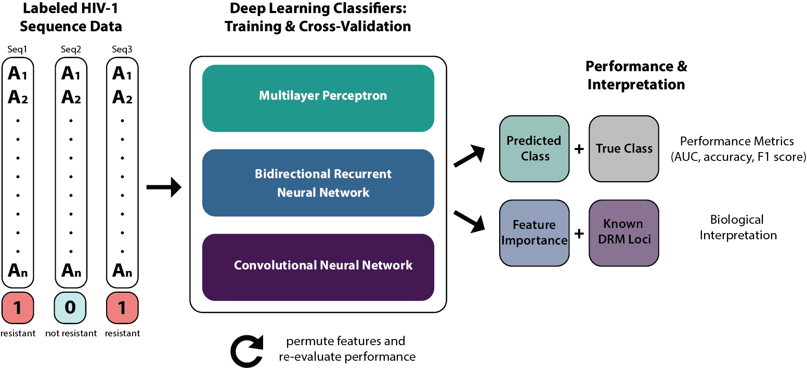

#  Drug Resistance Prediction Using Deep Learning Techniques on HIV-1 Sequence Data

This repository contains code used to train and evaluate deep learning classifiers for HIV-1 drug resistance prediction from sequence data (Steiner et al., 2020, _in review_). All data is publicly available via the [Stanford HIV Drug Resistance Database](https://hivdb.stanford.edu). All code was written in R, and all classifiers were developed and trained using the R interface to [Keras](https://keras.rstudio.com). Other packages used include the [IML](https://cran.r-project.org/web/packages/iml/vignettes/intro.html) package for model interpretation and [ggplot2](https://ggplot2.tidyverse.org) for data visualization. For more information on these methods, please refer to our paper.

**Author:** Margaret C. Steiner ([GitHub](https://github.com/maggiesteiner)), Computational Biology Institute, The George Washington University

**Citation information:** 
When referencing this project, please cite our recent publication, available [here](https://www.mdpi.com/1999-4915/12/5/560).  

Citation: Steiner, M.C.; Gibson, K.M.; Crandall, K.A. Drug Resistance Prediction Using Deep Learning Techniques on HIV-1 Sequence Data. _Viruses_ **2020**, 12, 560.

## Code and Data Files

Below are brief descriptions of the files included in this repository.

### Data Scripts

This directory contains files which were used for cleaning and formatting the raw data.

`NNRTI_stanford.csv`, `NRTI_stanford.csv`, and `PI_stanford.csv` are raw data files downloaded from the Stanford database. 
 
`datacleaning_file_NNRTI.R`,  `datacleaning_file_NRTI.R`, and  `datacleaning_file_PI.R` clean the raw files and separate the data into drug-specific dataframes.
 
`sequence_maker.R` includes functions to generate FASTA files from the dataframes generated in the data cleaning files. `fastascriptNNRTI.R`,  `fastascriptNRTI.R`, and `fastascriptPI.R` call this function to generate fasta files for input into the classifiers.

### FASTA Files

This directory includes FASTA files generated from the data cleaning steps.

### Test Scripts

This directory includes scripts used to train and evaluate all classifiers, including feature importance metrics, for MLP (`mlp_run_script.R`), BRNN (`brnn_run_script.R`), and CNN (`cnn_run_script.R`) models.  

### Results

The directories `MLP_Results`, `BRNN_Results`, and `CNN_Results` contain raw output files from the respective `Test Scripts` files (_.csv_ and _.txt_ formats).

### Figures

This directory includes scripts used to generate figures in `ggplot2`. 
Scripts used to generate figures. 

- `imp_plots_script.R`: top-20 feature importance plots
- `new_impplots_script_sequence.R`: whole-gene feature importance plots  
- `roc_script_mlp.R`, `roc_script_cnn.R`, and `roc_script_brnn.R`: ROC curves 
- `histogram_script.R`: histograms from feature importance data from `imp_plot_data.xlsx` summary file.

## Helpful Resources

- For readers interested in developing their own deep learning models in R, we recommend starting the tutorials provided [here](https://keras.rstudio.com/articles/getting_started.html). 
- For an introduction to machine learning concepts alongside R tutorials, we recommend this [book](https://www.manning.com/books/deep-learning-with-r). 
